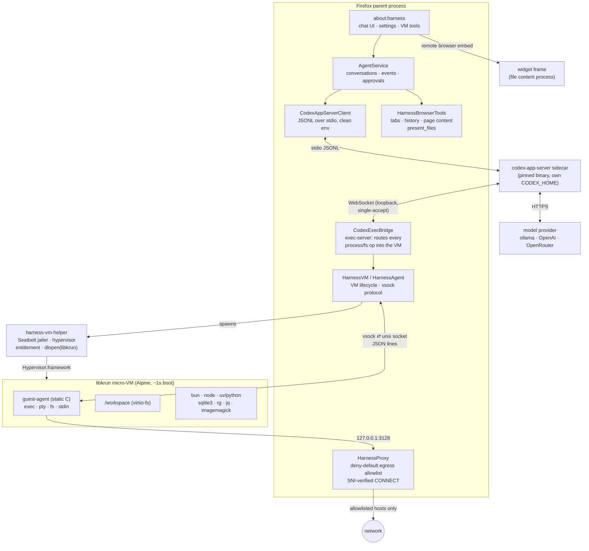
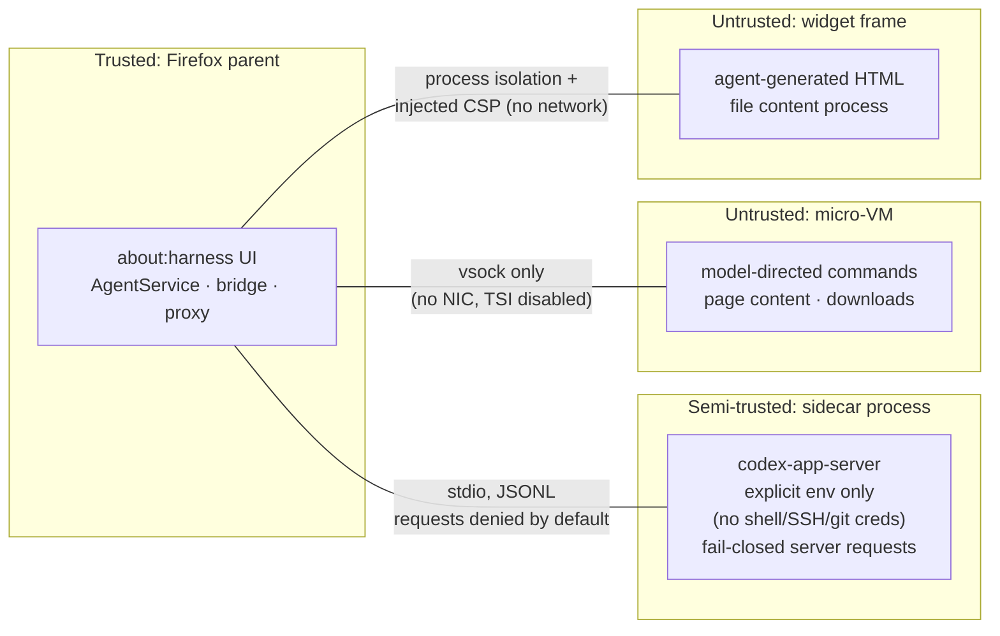
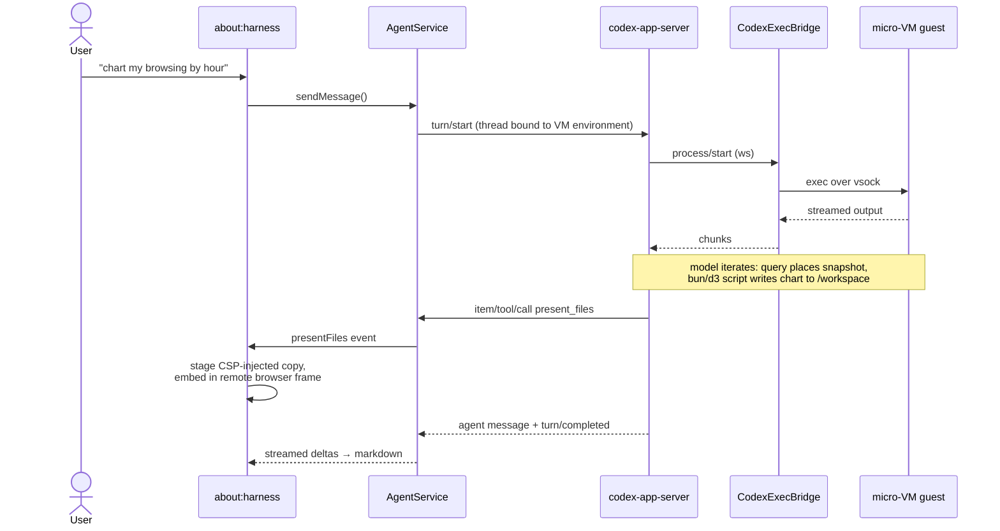

# Firefox Harness — Architecture Overview

An experiment in Firefox *hosting* a coding agent rather than being driven by
an external one. The agent loop comes from a pinned Codex App Server sidecar;
every command and file operation the model performs executes inside a libkrun
micro-VM. The hard invariant: **no model-generated command ever executes on
the host** — conversations fail closed if the VM is unavailable.

macOS arm64 only, pref-gated (`browser.harness.enabled`), development spike.

## System overview

The sidecar believes it is talking to a normal "exec server" environment; the
bridge impersonates that protocol and forwards every `process/*` and `fs/*`
request over vsock into the guest. The model never gets a host shell.

## Security boundaries

Layered enforcement, outermost first:

1. **VM boundary** — commands run in the guest; the only channels out are
   vsock (control) and virtio-fs (`/workspace`, explicit user mounts).
   Guest networking is off: libkrun's transparent-socket mode is disabled;
   HTTP(S) goes through the host-side policy proxy (deny-default allowlist,
   `CONNECT` verified against the TLS SNI, ECH rejected; default allows only
   the npm/pypi registries).
2. **Helper jailer** — the VM host process Seatbelt-sandboxes itself before
   loading libkrun: only the rootfs, declared volumes, and its sockets are
   reachable; read-only mounts are enforced host-side (and again in
   virtio-fs and in the guest mount).
3. **Bridge path policy** — exec-server fs ops are restricted to
   `/workspace` and `/mnt/<tag>`; writes to read-only mounts denied; every
   call audit-logged.
4. **Sidecar hygiene** — launched with a fully explicit environment
   (dedicated `CODEX_HOME`, no inherited shell state); unknown server→client
   requests are denied by default. Provider API keys live host-side only and
   are never guest-visible.
5. **Widget containment** — agent-authored HTML renders in a separate
   content process with an injected CSP that blocks all network, so
   presented artifacts cannot exfiltrate data the agent had access to.
   (about:harness is allowlisted for remote frames in `nsFrameLoader`,
   following the `aiWindow.html` precedent.)
6. **Browser tools** — read-only (tabs, history, extracted page text);
   private windows excluded; page content is staged into the sandbox as
   files marked untrusted, never inlined into model context.

## Anatomy of a turn

## Design decisions worth knowing

- **Sidecar, not SDK**: the agent loop is a pinned external binary speaking
  a versioned JSONL protocol — swappable, updateable, crash-isolated.
- **Codex persists chats** (rollout files in our dedicated `CODEX_HOME`);
  we deliberately keep no parallel chat store. Temporary mode = ephemeral
  threads.
- **Profile data is shared by snapshot, not by mount**: live SQLite (WAL)
  and virtio-fs don't compose; `Sqlite.sys.mjs` online-backup copies
  places.sqlite into `/workspace` for the guest's sqlite3.
- **JS-first guest toolchain**: bun runs TS and auto-installs npm deps
  without a package.json; charts are produced as SVG (matplotlib has no
  musl-arm64 wheels — a good example of the guest being a real, opinionated
  environment).
- **Sessions are cheap**: rootfs copies are APFS clones; per-conversation
  VMs are a pref away (`browser.harness.sessionPerConversation`). A
  template stamp auto-refreshes stale rootfs copies when baked-in tooling
  changes.
- **GPL hygiene**: libkrun (Apache-2.0) is vendored and shippable; the
  guest kernel (libkrunfw) and Alpine rootfs are pinned downloads and must
  become a runtime-fetched component (GMP-style) before any distribution.

## Where things live

| Layer | Code |
| --- | --- |
| UI | `content/aboutHarness.{html,mjs,css}` |
| Agent orchestration | `codex/AgentService.sys.mjs`, `codex/CodexAppServerClient.sys.mjs` |
| VM routing | `codex/CodexExecBridge.sys.mjs`, `codex/WebSocketServer.sys.mjs` |
| VM substrate | `HarnessVM.sys.mjs`, `HarnessAgent.sys.mjs`, `helper/`, `guest/` |
| Egress policy | `HarnessProxy.sys.mjs` |
| Browser tools | `HarnessBrowserTools.sys.mjs` |
| Image build | `vm/setup-deps.sh`, `vm/setup-codex.sh` |

Deeper reading: [README](../README.md) (setup, dev gotchas),
[codex-integration-plan](codex-integration-plan.md) (decisions + follow-ups),
[proxy-plan](proxy-plan.md), [model-providers-spike](model-providers-spike.md).
