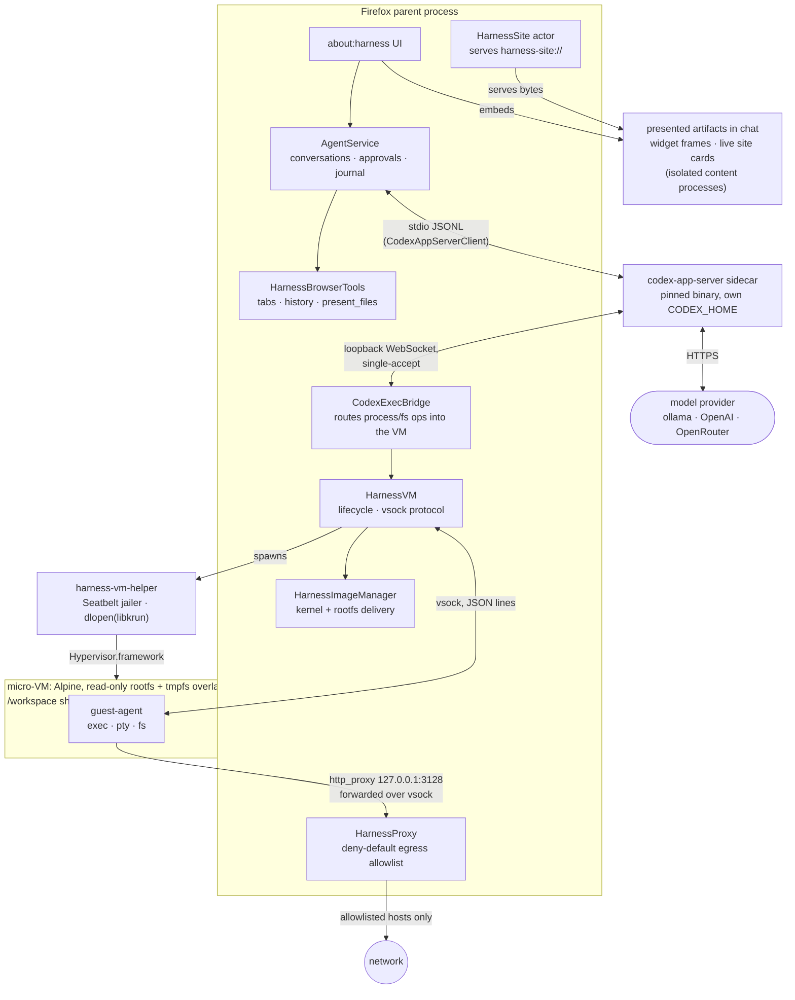
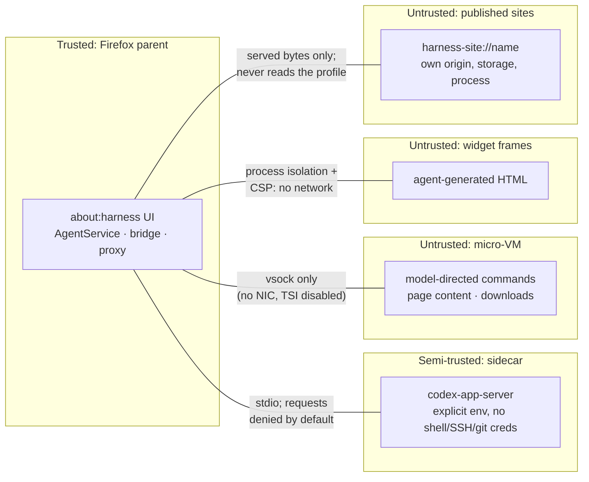
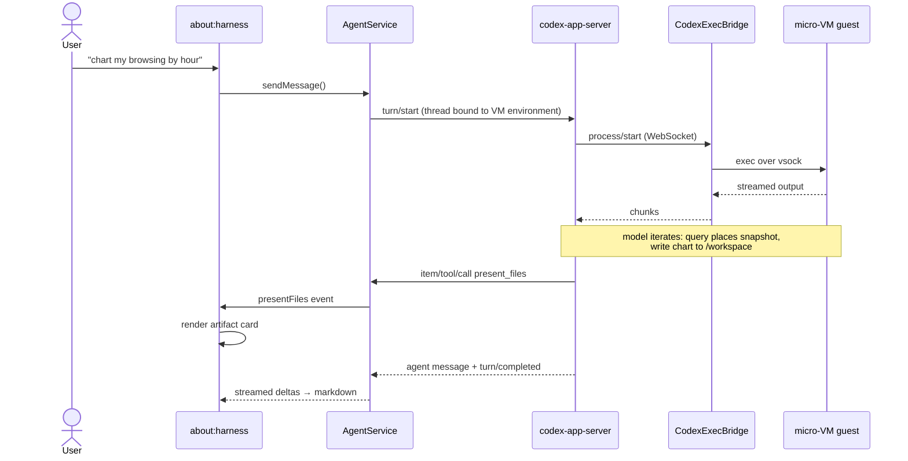

# Firefox Harness — Architecture Overview

An experiment in Firefox *hosting* a coding agent rather than being driven by
an external one. The agent loop comes from a pinned
[Codex App Server](https://github.com/openai/codex) sidecar; every command
and file operation the model performs executes inside a
[libkrun](https://github.com/containers/libkrun) micro-VM. The hard
invariant: **no model-generated command ever executes on the host** —
conversations fail closed if the VM is unavailable.

macOS arm64 only, pref-gated (`browser.harness.enabled`), development spike.
The complete branch diff:
[bgrins/firefox compare](https://github.com/bgrins/firefox/compare/0088392ab4cc...harness).

## System overview

The sidecar believes it is talking to a normal "exec server" environment; the
bridge impersonates that protocol and forwards every `process/*` and `fs/*`
request over [vsock](https://man7.org/linux/man-pages/man7/vsock.7.html) into
the guest. The model never gets a host shell.

## Security boundaries

Layered enforcement, outermost first (code in parentheses):

1. **VM boundary** — commands run in the guest; the only channels out are
   vsock (control) and [virtio-fs](https://virtio-fs.gitlab.io/)
   (`/workspace`, explicit user mounts). The rootfs is a host-enforced
   read-only virtio-fs — a per-start APFS clone of the template — with a
   whole-root tmpfs overlay in the guest, so writes outside `/workspace`
   are ephemeral and rebuilds cannot corrupt a running VM
   (`HarnessVM.sys.mjs`).
2. **Egress policy** — the guest has no NIC and libkrun's transparent
   networking (TSI) is disabled (`helper/harness-vm-helper.c`). HTTP(S)
   goes through a host-side proxy: deny-default allowlist, `CONNECT`
   verified against the TLS SNI, ECH rejected; the default list is just
   the npm and pypi registries (`HarnessProxy.sys.mjs`,
   `browser.harness.proxy.allowlist`).
3. **Helper jailer** — the VM host process Seatbelt-sandboxes itself
   before loading libkrun (which runs the guest on Apple's
   [Hypervisor.framework](https://developer.apple.com/documentation/hypervisor)):
   only the rootfs, declared volumes, and its sockets are reachable, and
   read-only mounts are enforced host-side (`helper/harness-vm-helper.c`).
4. **Bridge path policy** — exec-server fs ops are restricted to
   `/workspace` and `/mnt/<tag>`, writes to read-only mounts are denied,
   and every call is audit-logged (`codex/CodexExecBridge.sys.mjs`).
5. **Sidecar hygiene** — launched with a fully explicit environment
   (dedicated `CODEX_HOME`, no inherited shell state); unknown
   server→client requests are denied by default; provider API keys live
   host-side only and are never guest-visible
   (`codex/CodexAppServerClient.sys.mjs`).
6. **Widget containment** — agent-authored HTML renders in a separate
   content process with an injected CSP that blocks all network, so a
   presented artifact cannot exfiltrate data the agent had access to
   (`content/aboutHarness.mjs`; about:harness is allowlisted for remote
   frames in `nsFrameLoader`, following the `aiWindow.html` precedent).
7. **Site containment** — published sites get real per-site origins in
   origin-keyed (`webIsolated`) content processes with a serve-time CSP;
   content processes never read the profile — a JSWindowActor serves the
   bytes — and web pages cannot link to or fetch the scheme
   (`URI_DANGEROUS_TO_LOAD`; `actors/HarnessSiteParent.sys.mjs`).
8. **Browser tools** — read-only (tabs, history, extracted page text),
   private windows excluded; page content is staged into the sandbox as
   files marked untrusted, never inlined into model context
   (`HarnessBrowserTools.sys.mjs`).
9. **Image delivery** — remote kernel/rootfs installs are https-only,
   sha256-verified, and staged-then-renamed, with manifest path components
   validated; offline falls back to the newest installed image
   (`HarnessImageManager.sys.mjs`).

## Anatomy of a turn

## Design decisions worth knowing

- **Sidecar, not SDK**: the agent loop is a pinned external binary speaking
  a versioned JSONL protocol — swappable, updateable, crash-isolated.
- **Codex persists chats** (rollout files in our dedicated `CODEX_HOME`);
  the only host-side chat state is a per-conversation rendering journal,
  because codex's resume drops command output and presented artifacts.
  Temporary mode = ephemeral threads, never journaled.
- **Native edits via apply_patch**: a generated model catalog maps our
  [OpenRouter](https://openrouter.ai) slugs onto codex's bundled model
  metadata, which unlocks codex's built-in apply_patch tool — structured
  diffs routed through the exec-server fs bridge into the VM.
- **Publish by writing**: anything under `/workspace/sites/<name>/` with
  an `index.html` is live at `harness-site://<name>/` — no deploy step, a
  reload shows edits, and localStorage/IndexedDB persist per site across
  restarts. Cards embed the live origin in the chat.
- **Profile data is shared by snapshot, not by mount**: live SQLite (WAL)
  and virtio-fs don't compose; `Sqlite.sys.mjs` online-backup copies
  places.sqlite into `/workspace` for the guest's sqlite3.
- **JS-first guest toolchain**: [bun](https://bun.sh) runs TS and
  auto-installs npm deps without a package.json; Python is available via
  [uv](https://github.com/astral-sh/uv); sqlite3, ripgrep, jq and
  imagemagick are baked in (`vm/setup-deps.sh`). Charts are produced as
  SVG (matplotlib has no musl-arm64 wheels — a good example of the guest
  being a real, opinionated environment).
- **Sessions are cheap**: a VM boots in about a second and rootfs copies
  are APFS clones; per-conversation VMs are a pref away
  (`browser.harness.sessionPerConversation`). A template stamp
  auto-refreshes stale rootfs copies when baked-in tooling changes.
- **GPL hygiene**: libkrun (Apache-2.0) is vendored and shippable; the
  guest kernel ([libkrunfw](https://github.com/containers/libkrunfw)) and
  [Alpine](https://alpinelinux.org/) rootfs are pinned downloads —
  `HarnessImageManager` is the runtime-fetch path
  ([GMP](https://wiki.mozilla.org/GeckoMediaPlugins)-style manifest,
  sha256, staged installs) that production needs before any distribution
  (see [image-download-plan](image-download-plan.md)).

## Where things live

| Layer | Code |
| --- | --- |
| UI | `content/aboutHarness.{html,mjs,css}` |
| Agent orchestration | `codex/AgentService.sys.mjs`, `codex/CodexAppServerClient.sys.mjs` |
| VM routing | `codex/CodexExecBridge.sys.mjs`, `codex/WebSocketServer.sys.mjs` |
| VM substrate | `HarnessVM.sys.mjs`, `HarnessAgent.sys.mjs`, `helper/`, `guest/` |
| Image delivery | `HarnessImageManager.sys.mjs` |
| Published sites | `HarnessSiteProtocol.sys.mjs`, `actors/HarnessSite{Parent,Child}.sys.mjs` |
| Egress policy | `HarnessProxy.sys.mjs` |
| Browser tools | `HarnessBrowserTools.sys.mjs` |
| Image build | `vm/setup-deps.sh`, `vm/setup-codex.sh` |

Deeper reading: [README](../README.md) (setup, dev gotchas),
[codex-integration-plan](codex-integration-plan.md) (decisions + follow-ups),
[proxy-plan](proxy-plan.md), [model-providers-spike](model-providers-spike.md),
[mcp-plan](mcp-plan.md) (MCP findings + guest-side server plan).
